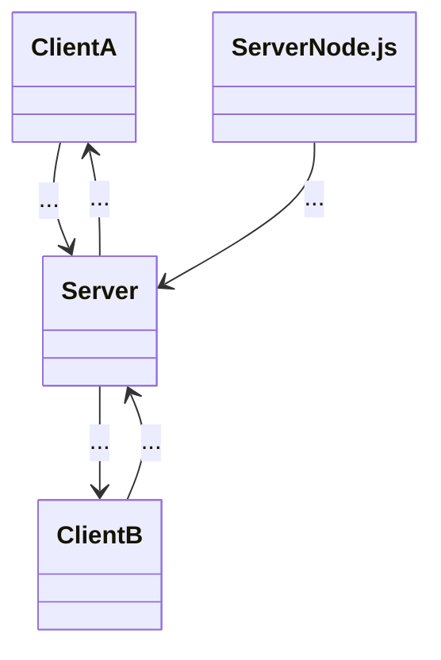

# Sistemas de Redes para Jogos - LuckyMultiplayer

## 👤 Author

Artur Martins a22304625

## 🎯 Goal

The goal of this project is to build an online game (or part of it). The theme
 that I choose was to implement a client/server action game with
 login/matchmaking (4), using Unity Netcode for Game Objects.

## 🎮 Description

### What was implemented

- Network setup
- Synchronization
- Game loop
- Node.js
- Login(username)
- Matchmaking

### Techiniques used

First, it was installed from the Package Manager the Netcode for GameObjects
 (NGO). Then it was created an empty gameObject named NetworkManager. Inside of
 that gameObject, I attached the script `NetworkManager` that is the heart of
 the Network for GameObject (NGO). The NetWorkManager also needs to have the
`UnityTransport` component.

A core script named `NetworkSetup` is responsible for detecting if the
 application is running as a server or client through command-line arguments or
 with the tool builder (see more at "How to run the project"). Based on this, it
 initializes the appropriate network role and insures that each player is
 assigned ownership of their respective `NetworkObject`. This allows proper
 state synchronization across the network, ensuring each client to control their
 own player.
For streamline testing, the `NetworkSetup` also helps the project to have an
 automated build tools via Unity Editor scripts. These tools allow for quick
 build and launch of multiple instances, in this case a server and 2 clients.
A **Node.js server** is used as a backend service to manage the login(username)
 and matchmaking. Players first insert their username and they are grouped into
 1vs1 game. The unity server is checking with this Node.js service to fetch a
 matchmaking result and then starts the match by notifying both Unity clients
 by sending an message and releasing the UI of both players (clients).

Each player prefab needs to have a `NetworkTransform` with the
 **Authority Mode** set to **Owner**. This setting is crucial in multiplayer
 games because it defines who has the right to update and synchronize the
 object's transform(position,rotation and scale). In this case, the **Owner**
 authority means that the client owns the object (playerPrefab) and it is
 responsible for sending movement and input data to the server.

The script `Spawner` is a server-authoritative gem spawning system that
 activates when two players are connected and the match is confirmed. This
 happens through the method `StartSpawnServerRpc()` that is called by the
 `LoginAndMatchmaking` script that handles the server.js updates. This method
 is marked as a **Server Remote Procedure Call (ServerRpc)** that means, that
 this method will only be executed on the server instance of the game.
The gems are essential for the main game loop, it allow players to catch them
 and use their abilities, until we got a winner/loser UI display.
 Only the server performs the spawning, in order to ensure that all clients
 receive the same synchronized gem state. If all players disconnect, the script
 removes all gems.

NetworkVariable is a synchronized variable shared across the network, that
 automatically keeps values in sync between the server and all clients.
So, in order for each player to see the health, level or a shield activated in
 a synchronize way, the script `DiamondGemSystem` has 4 NetworkVariables
 (diamonds, health, level, shieldActivated). This script is inside of each
 player prefab that also triggers automatic OnValueChanged events that updates
 the UI and some visuals (shield, health bar, diamonds counter).

Example of NetworkVariable:

 ```shell
private NetworkVariable<ushort> health = new NetworkVariable<ushort>(
            10, NetworkVariableReadPermission.Everyone, 
                NetworkVariableWritePermission.Server);
```

The health NetworkVariable is of type ushort, initialize with 10 of value. So,
 each player starts with 10 health.
 Client and server can read these values but only the server can change them.
 This is to prevent cheating and to automatically keep the game state consistent
 for both players. The other NetworkVariables are the same, the server is the
 authoritative source of truth.

### Network architecture diagram

- Server handles the communication of the node.js, matchmaking, game logic,
  and state sync.
- Clients send input/actions and receive game state updates.



## 🚀 How to run the project

1. Install <https://nodejs.org/pt>(node.js).
2. Open git bash.
3. Enter the folder matchmaking-server.
4. Type: node server.js
5. Server is now running, it will say something like "Matchmaking server running on <http://localhost:3000>
6. Open with Unity project.
7. Tools -> Launch Server + Client or Launch 2 times the Client, and be the server.
8. Both Clients will have an UI to insert their usernames.
9. After both usernames were logged in, the match will begin showing both clients the game.
10. When a Client reaches 0 or lower hp, and UI display on both Clients showing the results.
11. If both press the button Restart, the game will restart.

## References

### Unity Documentation

Unity Netcode for GameObjects: <https://docs-multiplayer.unity3d.com/netcode/1.1.0/tutorials/get-started-ngo/>

### Youtube

Sistemas de Redes para Jogos - Aula 31/03/2025: <https://www.youtube.com/watch?v=xclY9ujY4Tk&ab_channel=DiogoAndrade>

The Ultimate Multiplayer Tutorial for Unity - Netcode for GameObjects: <https://www.youtube.com/watch?v=swIM2z6Foxk&t=1591s&ab_channel=samyam>

### Chatgpt

Node.js matchmaking with Unity
